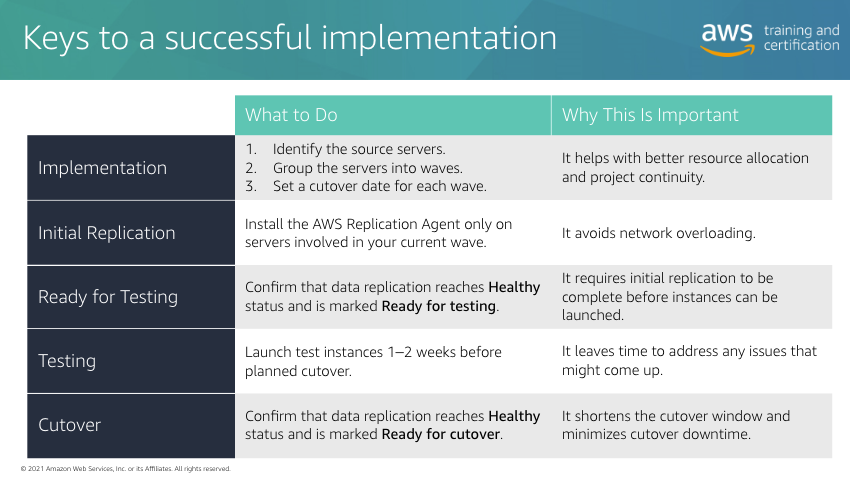
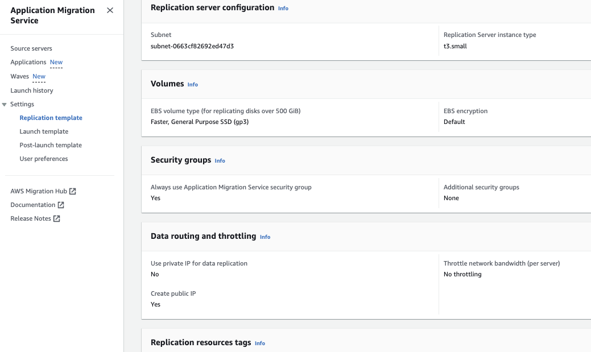

# AWS-Application-Migration-Service
I have been tasked to lead the migration of our client stand-alone server on equinix bare metal to AWS. In my research and studies, I found out AWS Application Migration Service which is the AWS recommended service to quickly carryout lift and shift from any source (On-prem, Accross regions and from other Cloud)
This Hands-On Training is on how to easily and securely carryout Lift n Shift Application Migration from any source server to AWS using AWS MGN.
Save time and cost and reduce risk by first lifting and shifting your application before modernizing them. AWS MGN is free for 90 days after which you are charged per hour of migration.


# Service Benefits include
- Flexible
    - Migration from any source
    - Wide range of OS, Application and db support
    - suitable for large-scale migrations
- Reliable 
    - Non-disruptive
    - continuous replication
    - predictable
    - short cutover windows
    - minimal downtime
    - Highly secured 
- Highly automated
    - minimal skill set required
    - launch easy, non-disruptive tests prior to cutover
    - Easily plug into migration factories and cloud COEs

- Have a look at the recommendations from AWS


# LAB
In this lab we will be replicating client application on equinix(on-prem) to target region Ireland(eu-west-1). But for the purpose of this lab, we will simulate this on-prem server(WordPress server) and replicate it into US East(N. Virginia) region.

## Services and Terminology
- AWS Replication Agent(The agent) - A piece of software that we will install on the source machine(equinix bare metal server) simulated using AWS EC2 that will be responsible for sending the original data into AWS.
- Replication server - An EC2 instance which is responsible for receiving the data from the agent and persisting it to EBS volumes.
- Staging area subnet - A subnet we will create in our VPC where all the original data will be replicated into.
- Conversion server - An EC2 instance which is responsible for implementing changes to allow your server to run natively in Amazon EC2.

## Steps
1. Step 0: Prerequisites
- Network Requirements
    - Source server: 
        - Direct access to the AWS MGN and Amazon S3 services API endpoints throught HTTPS protocol(TCP port 443);(MGN endpoint: https://mgn.{region}.amazon.com/).The source server will download additional requirement for the agent installation from S3
        - Direct outbound TCP port 1500 from the source server to the staging area subnet, which contains the replication servers
    - Staging area subnet
        - Direct access to the AWS MGN, Amazon EC2 and Amazon S3 services API endpoints throught HTTPS protocol(TCP port 443)
        - Direct inbound TCP port 1500

2. Step 1: Creating an IAM user
    - The credentials of an IAM user will be used by the AWS Replication Agent.
    - Use predefined AWS managed policy for the permission control that contains only the necessary permissions to add server to AWS MGN console.
    - follow the steps here [Create AWS IAM User](https://docs.aws.amazon.com/IAM/latest/UserGuide/id_users_create.html#id_users_create_console) to create user with required permissions. Also assign programmatic access and search and apply **AWSApplicationMigrationAgentPolicy** policy to it.
    - Download the .csv credential that will be created at the end.

3. Step 2: Accessing the AWS MGN Console
    - Navigate to the management console and search and navigate to the AWS MGN console
    - If this is the first time visiting the console, click **Get started** and accept the condition. A default Replication template will be created for you.

4. Step 3: Configuring the Replication Settings
    - Click on ***Replication template*** under *Settings* to modify it.
    - Select the setting as seen below or change the instance type to t4g.small which is latest or higher if you are migrating a heavy app with high IOPS.
    
    - you can also select a faster EBS volume greater than 500GiB if you app is IO intensive.
    - choose to encrypt the EBS
    - The sg that will be created ensures that all the ports and protocols are allowed.
    - Leave the **Data routing and throttling at default. We will be transferring using the public internet. You can also use your private connections such as DX, VPN or VPC peering to replicate your data.

5. Step 4: Installing the AWS Replication Agent
    - Create the source server.
    - Visit EC2 console and click on *launch instance*
    - Inpute a name for the Wordpress server instance that we are simulating
    - Be sure that you are in the N. Virginia region.
    - search and select **MGN Workshop-IIS** under community AMIs.
    - on the 'advanced configuration', beside **IAM Instance Profile** click create role
    - Attach the following policies directly
    ```
        AmazonSSMFullAccess
        AmazonSSMManagedInstanceCore
        AmazonSSMManagedEC2InstanceDefaultPolicy
    ```
    - On the EC2 console select the newly created role and click to create instance
    - Back to the MGN Console click on **Add servers** to download the agent installer
    - select *windows* provide the IAM access key ID and Secret access key ID of the user we created earlier.
    