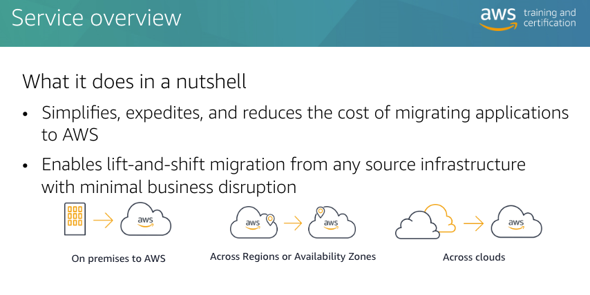
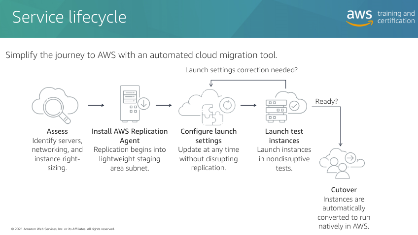

# AWS-Application-Migration-Service
I have been tasked to lead the migration of our client stand-alone server on equinix bare metal to AWS. In my research and studies, I found out AWS Application Migration Service which is the AWS recommended service to quickly carryout lift and shift from any source (On-prem, Accross regions and from other Cloud)
This Hands-On Training is on how to easily and securely carryout Lift n Shift Application Migration from any source server to AWS using AWS MGN.

# Service Benefits include
- Flexible
    - Migration from any source
    - Wide range of OS, Application and db support
    - suitable for large-scale migrations
- Reliable 
    - Non-disruptive
    - continuous replication
    - predictable
    - short cutover windows
    - minimal downtime
    - Highly secured 
- Highly automated
    - minimal skill set required
    - launch easy, non-disruptive tests prior to cutover
    - Easily plug into migration factories and cloud COEs

